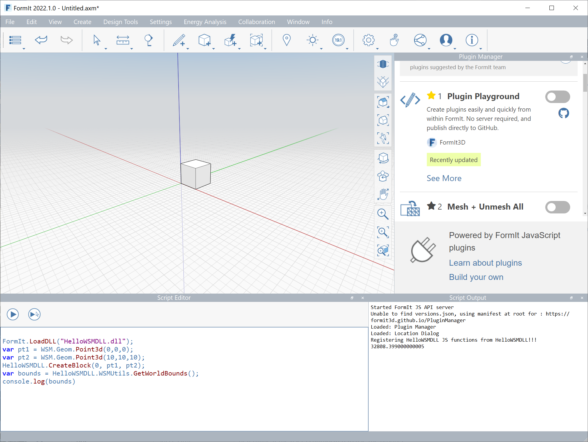

WSM Addin example creating user defined JS commands using WSM C++ APIs.
========================

This is an example of a solution to create and inject JS commands into FormIt.

1) Download the FormItSupport directory from the ADN web site.
2) Unzip the directory into the solution.
3) Build the DLL
4) User the following commands to load the execute the commands in the Script Editor window.

FormIt.LoadDLL("HelloWSMDLL.dll");
var pt1 = WSM.Geom.Point3d(0,0,0);
var pt2 = WSM.Geom.Point3d(10,10,10);
HelloWSMDLL.CreateBlock(0, pt1, pt2);
var bounds = HelloWSMDLL.WSMUtils.GetWorldBounds();
console.log(bounds)
